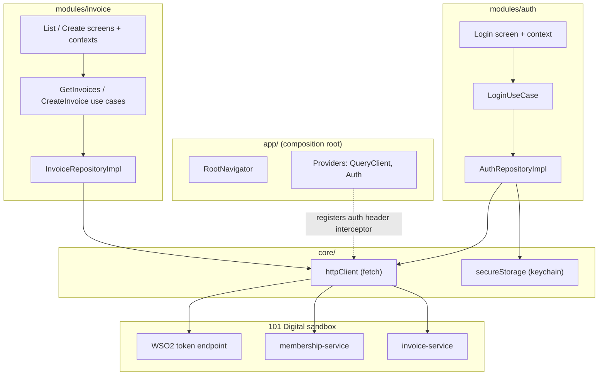
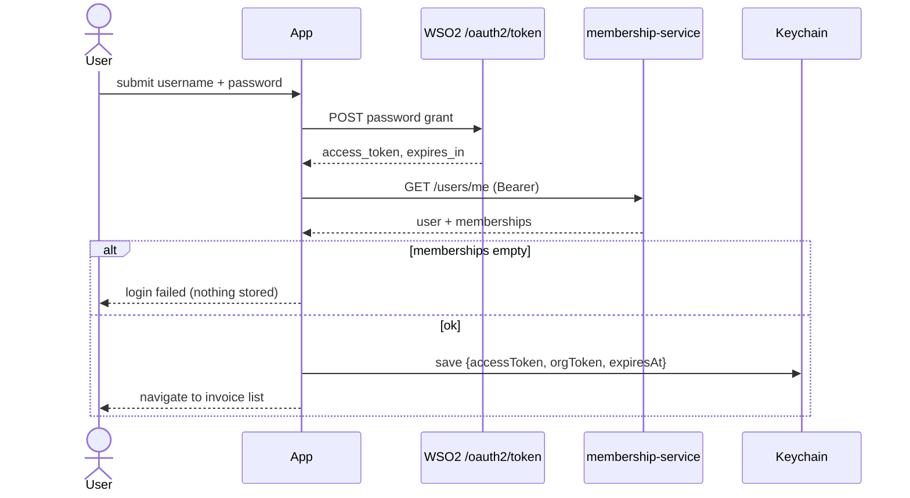

# SimpleInvoice — Technical Specification

| | |
|---|---|
| Version | 1.0 |
| Status | Draft |
| Platform | iOS + Android (React Native CLI) |
| Related docs | `DOMAIN.md` (entities), `USECASES.md` (business rules), `UI_DESIGN.md` (routing, components, forms) |

## 1. Introduction

### 1.1 Purpose

Describes the architecture, technology choices, code organization, and delivery
process for SimpleInvoice — an invoicing app built for the 101 Digital mobile
assessment. Audience: the technical evaluation team and any developer picking
up the codebase.

### 1.2 Scope

In scope:
- Login against 101 Digital sandbox (OAuth2 password grant + org token)
- Create invoice (single line item)
- Invoice list with search, sort, filter, pagination
- Session restore and logout

Out of scope:
- Backend development (all services are provided by 101 Digital sandbox)
- Offline mode / local persistence of invoices
- Automated tests (unit / integration) — quality gates are lint + typecheck
- Push notifications, deep linking
- App Store / Play Store distribution

## 2. System Design

### 2.1 Context

SimpleInvoice is a client-only system. All business data lives in 101 Digital's
sandbox services; the app authenticates, reads, and writes over REST. There is
no app-owned backend.

| Actor | Interface | Responsibility |
|---|---|---|
| Invoice user | Mobile app | Logs in, creates invoices, browses/searches the list |
| 101 Digital sandbox | REST APIs | Identity provider (WSO2), membership-service, invoice-service |

### 2.2 Component Architecture

The app is a modular monolith: two feature modules (`auth`, `invoice`) plus a
feature-blind `core`, composed in `app/`. Each module is layered internally —
presentation, domain, data.



Dependency rules (enforced by review, optionally by ESLint import rules):
- modules depend on `core`, never the reverse
- modules never import each other's internals; auth exposes itself to the http
  client via an interceptor registered at composition time, so the invoice
  module has zero imports from auth
- domain folders import nothing from React Native, fetch, or TanStack

### 2.3 Authentication Flow

Two-token model. The access token comes from the OAuth2 password grant; the
org token is extracted from the user's first membership and is required by the
invoice-service. Both are stored as one atomic session.



Session rules: all-or-nothing persistence (never an access token without an
org token), expiry checked locally on app start, 401 on any request forces
logout and session wipe.

### 2.4 State Management

Split by state type — the two stores never duplicate each other:

| State type | Owner | Examples |
|---|---|---|
| Server state | TanStack Query cache | invoice pages, create-invoice mutation status |
| Screen/UI state | Context per screen (controller) | form values, active filters, debounced keyword |
| Session state | AuthProvider (app level) | is a session present → which navigator stack |

The list screen's `InvoiceQuery` object (filters + sort + keyword) is placed
inside the TanStack query key, so filter changes trigger refetches without
manual effects, and each filter combination gets its own cache entry.
Pagination uses `useInfiniteQuery`; `pageNum` stays out of the key and flows
through `pageParam`.

### 2.5 Error Handling

- `httpClient` normalizes every failure into a typed `ApiError`
  (status, code, message) — no raw fetch errors leave the data layer
- 401 → global handler clears session, resets query cache, returns to login
- List screen keeps already-loaded pages on refetch failure; shows retry
- Create form preserves user input on any failure; server validation messages
  surface on the form
- Tokens and request bodies are never logged

### 2.6 ADR-001 — Client Secret Handling

**Context.** Appendix A mandates the OAuth2 password grant with a fixed
`client_id`/`client_secret` against a shared WSO2 tenant we cannot configure.
The correct production fixes — Authorization Code + PKCE (no secret exists;
requires server-side client registration we don't control) or a
token-exchange proxy holding the secret (out of scope; the spec requires the
app to call the documented endpoints) — are both unavailable. A secret
shipped in a mobile binary is extractable by a sufficiently motivated
attacker regardless of technique; client-side measures raise cost, they do
not eliminate risk.

**Decision.** The secret is compiled into native C++ and retrieved by call
at token-exchange time only:

- `.env.secrets` (gitignored) → `gen-secrets.js` → XOR-obfuscated generated
  header (gitignored, fresh random key per build) → shared `secrets.cpp`
  decoder → Android NDK `.so` via JNI / iOS Obj-C++ → promise-based native
  module → `getOAuthClientCredentials()` in `core/security`
- sole caller: `AuthRepositoryImpl` token exchange; never cached in JS,
  never logged, never in state or context
- `CLIENT_ID`/`CLIENT_SECRET` are removed from react-native-config's `.env`
  (whose keys compile to plaintext `BuildConfig` fields) — `.env` carries
  URLs only
- R8/ProGuard enabled on release builds

**Consequences.** Defeats `strings`/grep extraction and automated secret
scanners; committed source contains no secret in any form. Residual risk:
native disassembly or runtime hooking (Frida) on a compromised device —
accepted, as closing it requires server-side attestation (Play Integrity /
App Attest) the sandbox does not offer. Login form ships with blank fields;
sandbox user credentials are never embedded.


## 3. Technology Stack

| Concern | Choice | Rationale |
|---|---|---|
| Framework | React Native CLI, TypeScript | Mandated by the assessment; TS for compile-time safety in domain contracts |
| Server state | TanStack Query v5 | Caching, infinite pagination, refetch-on-filter, mutation lifecycle — removes an entire class of hand-written loading/error/effect code |
| Networking | Plain `fetch` wrapped in one `httpClient` | Built into RN, zero dependency; wrapper adds base URL, JSON handling, timeout, error normalization. Axios adds nothing needed here |
| UI state | React Context per screen | Screen-scoped controllers; small surface, no global store needed at this size. Redux would be ceremony without payoff |
| Navigation | React Navigation (native stack) | De-facto standard; expo-router-style `app/` tree (see UI_DESIGN §1); stacks switched on session presence |
| System bars / insets | react-native-edge-to-edge + react-native-safe-area-context | Android 15 enforces edge-to-edge anyway; insets consumed once inside the `Screen` primitive |
| Secure storage | react-native-keychain | Tokens in iOS Keychain / Android Keystore — AsyncStorage is plaintext and fails the security criterion |
| Config/secrets | react-native-config (.env) | Keeps client_id/secret out of source; `.env` gitignored, `.env.example` committed |
| Forms | react-hook-form + zodResolver | Uncontrolled field state → per-field re-renders; server rejections mapped back via `setError` |
| Validation & domain types | Zod (schema-first domain) | One declaration = validation rules + inferred TS types; also `safeParse`s API responses at the DTO boundary |
| Lint/format | ESLint + Prettier | RN community config; optional import-boundary rules for the module dependency rules |

Version policy: latest stable at project creation; exact versions pinned in
`package.json` lockfile.

## 4. File Organization

Vertical feature modules with layers repeated inside each module. Chosen over
a horizontal (by-type) layout because every real change here touches one
feature across all layers — vertical keeps that change in one folder and lets
a reviewer read a feature top-to-bottom.

```
src/
├── app/                        # expo-router-style route tree + composition root
│   ├── _layout.tsx             # providers, edge-to-edge, root navigator (session switch)
│   ├── routes.ts               # param lists + route constants (all navigation types)
│   ├── providers.tsx           # QueryClientProvider + AuthProvider
│   ├── di.ts                   # wiring: repo impls -> use cases
│   ├── (auth)/
│   │   ├── _layout.tsx         # auth stack
│   │   └── login.tsx           # re-exports LoginScreen from modules/auth
│   └── (main)/
│       ├── _layout.tsx         # main stack
│       ├── index.tsx           # invoice list (initial route)
│       └── create-invoice.tsx
├── core/                       # shared kernel — feature-blind
│   ├── network/                # httpClient (fetch), ApiError, endpoints
│   ├── storage/                # secureStorage (keychain wrapper)
│   ├── query/                  # queryClient config
│   ├── ui/
│   │   ├── theme/              # tokens.ts (colors, spacing, radius, typography)
│   │   ├── primitives/         # Layer 1: Screen, Box, AppText, AppButton, AppInput, Spinner
│   │   └── components/         # Layer 2 (feature-blind): TextField, FormTextField, EmptyState, ErrorBanner
│   └── utils/                  # date helpers (validation lives in Zod schemas, not here)
└── modules/
    ├── auth/
    │   ├── domain/
    │   │   ├── schemas/        # LoginSchema, session/user schemas (types inferred)
    │   │   ├── repositories/   # IAuthRepository
    │   │   └── usecases/       # LoginUseCase, LogoutUseCase, RestoreSessionUseCase
    │   ├── data/               # dto schemas, mappers, AuthRepositoryImpl, header interceptor
    │   ├── presentation/
    │   │   └── login/          # LoginScreen, LoginContext, useLoginMutation, sections
    │   └── index.ts            # public API of the module
    └── invoice/
        ├── domain/
        │   ├── schemas/        # InvoiceDraftSchema, InvoiceSchema, InvoiceQuery
        │   ├── repositories/   # IInvoiceRepository
        │   └── usecases/       # GetInvoicesUseCase, CreateInvoiceUseCase
        ├── data/               # dto schemas, invoiceMapper, InvoiceRepositoryImpl
        ├── presentation/
        │   ├── queryKeys.ts    # invoiceKeys — owned by the module, not global
        │   ├── list/           # screen, context, useInvoicesQuery, sections
        │   ├── create/         # screen, context, useCreateInvoiceMutation, sections
        │   └── shared/     # Layer 2 (invoice-specific): InvoiceCard, SearchBar, FilterChips
        └── index.ts
```

Layer responsibilities inside a module:

| Layer | Contains | Must not contain |
|---|---|---|
| domain | Zod schemas (entities + business rules, types inferred), repository interfaces, use cases | any RN / fetch / TanStack import (Zod is allowed — it is the domain language) |
| data | DTO schemas (raw API shapes, `safeParse`d at the boundary), mappers, repository implementations | UI concerns |
| presentation | screen (dumb view), context (controller), query/mutation hooks, query keys, shared | direct repository calls — always via use case |

Ownership decisions (where the two designs met):

- `app/` owns all navigation — navigators, param types, route files. There is
  no `core/navigation`; route files are one-line re-exports so screens stay
  owned by modules
- Layer-2 composition splits by the core admission test: feature-blind pieces
  (`TextField`, `FormTextField`, `EmptyState`, `ErrorBanner`) live in
  `core/ui/components`; anything mentioning invoices stays in
  `modules/invoice/presentation/shared`
- Query keys are module-owned (`invoice/presentation/queryKeys.ts`), not a
  global registry — only the invoice module invalidates its lists; logout
  clears the whole cache and needs no keys
- There is no hand-written validator util: validation rules live in domain
  Zod schemas, consumed by forms via `zodResolver` and by data via DTO
  `safeParse`

Flow through the layers:
`Screen → Context → TanStack hook → UseCase → IRepository → Impl → httpClient → API`

`core` admission test: "would this file be identical if the app had completely
different features?" — http client yes, anything mentioning invoices no.

## 5. Development & Release

### 5.1 Environments & Secrets

Single external environment (101 Digital sandbox). Config via env files:

| File | Committed | Contents |
|---|---|---|
| `.env` | no (gitignored) | CLIENT_ID, CLIENT_SECRET, AUTH_BASE_URL, API_BASE_URL |
| `.env.example` | yes | same keys, values blank |

Sandbox credentials are treated as real secrets per the assessment note: never
committed, never logged. `.gitignore` includes `.env` from the first commit.

### 5.2 Local Development

```
npm install
cd ios && pod install && cd ..     # iOS only
cp .env.example .env               # then fill values
npm run ios | npm run android
```

Quality gates run locally and must pass before any merge:

```
npm run lint
npm run typecheck                  # tsc --noEmit
```

### 5.3 Source Control

- trunk-based with short-lived feature branches (`feat/invoice-list`)
- conventional commits (`feat:`, `fix:`, `docs:`)
- `main` is always buildable; each assessment feature lands as one reviewed PR
  so history reads as a narrative of the build

### 5.4 CI

GitHub Actions on every push/PR: install → lint → typecheck.
[PLACEHOLDER: add Android debug-build job producing an APK artifact if review
time allows — nice-to-have, not required for submission.]

### 5.5 Release for Review

Deliverables for the evaluation team:

1. Repository link (with README covering setup, `.env` instructions, and
   architecture summary pointing at this spec)
2. Android: signed debug APK attached to a GitHub release — installable
   without any toolchain
3. iOS: run-from-source via Xcode/simulator (no paid signing assumed);
   simulator build attached if useful
4. Demo walkthrough of login → create → list/search during the presentation

Versioning: `v0.x` during development, `v1.0.0` tag = submitted build. App
version in `package.json` mirrored to native `versionName` / iOS marketing
version.

Rollback is not applicable (no server deployment); a bad build is addressed by
tagging and distributing a new APK.

## 6. Open Items

- [ ] Capture real API response shapes (list envelope, status values) — see
      `DOMAIN.md` open items; affects DTOs and `getNextPageParam`
- [ ] Decide on refresh-token silent re-auth if the token endpoint returns one
- [ ] CI APK artifact job (5.4 placeholder)
