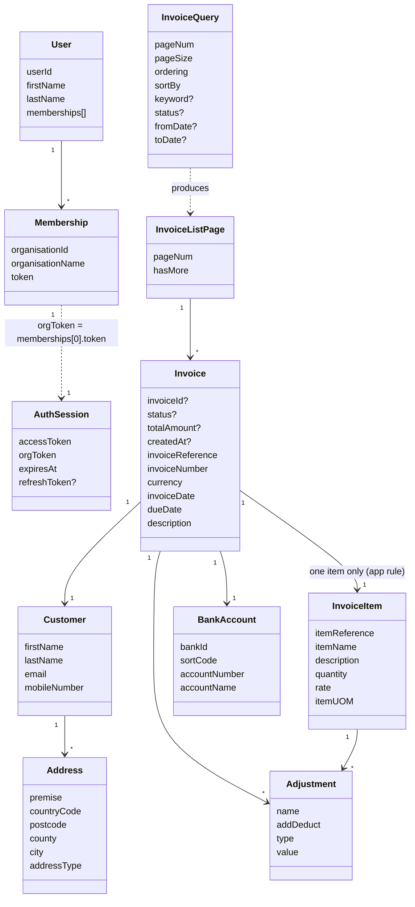

# Domain Model

```mermaid
classDiagram
    class AuthSession {
      accessToken
      orgToken
      expiresAt
      refreshToken?
    }

    class User {
      userId
      firstName
      lastName
      memberships[]
    }

    class Membership {
      organisationId
      organisationName
      token
    }

    class Invoice {
      invoiceId?
      status?
      totalAmount?
      createdAt?
      invoiceReference
      invoiceNumber
      currency
      invoiceDate
      dueDate
      description
    }

    class InvoiceItem {
      itemReference
      itemName
      description
      quantity
      rate
      itemUOM
    }

    class Customer {
      firstName
      lastName
      email
      mobileNumber
    }

    class Address {
      premise
      countryCode
      postcode
      county
      city
      addressType
    }

    class BankAccount {
      bankId
      sortCode
      accountNumber
      accountName
    }

    class Adjustment {
      name
      addDeduct
      type
      value
    }

    class InvoiceQuery {
      pageNum
      pageSize
      ordering
      sortBy
      keyword?
      status?
      fromDate?
      toDate?
    }

    class InvoiceListPage {
      pageNum
      hasMore
    }

    User "1" --> "*" Membership
    Membership "1" ..> "1" AuthSession : orgToken = memberships[0].token

    Invoice "1" --> "1" Customer
    Invoice "1" --> "1" BankAccount
    Invoice "1" --> "1" InvoiceItem : one item only (app rule)
    Invoice "1" --> "*" Adjustment
    InvoiceItem "1" --> "*" Adjustment
    Customer "1" --> "*" Address

    InvoiceQuery ..> InvoiceListPage : produces
    InvoiceListPage "1" --> "*" Invoice
```

Notes

- `?` = server-generated or optional, confirm after hitting real API
- Adjustment = what the API calls "extensions" (tax / discount)
- dates are YYYY-MM-dd strings